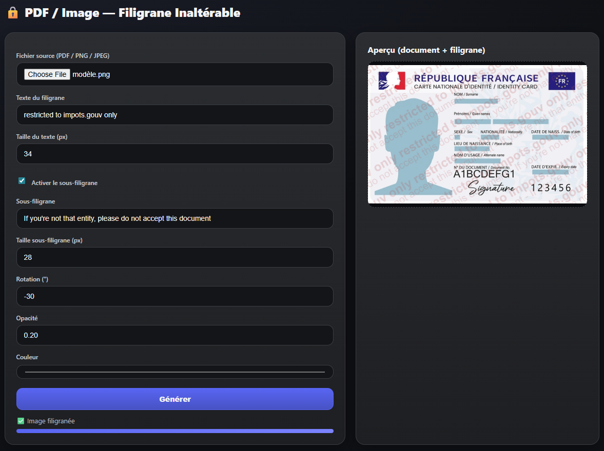

# 🔒 PDF / Image — Filigrane Inaltérable (Single‑file)

Outil **100 % côté client** (HTML + JavaScript) permettant d’ajouter un **filigrane inaltérable** sur des **PDF** et des **images (PNG / JPEG)**, avec aperçu en temps réel.  
Aucune donnée n’est envoyée sur un serveur.

---

---

## ✨ Fonctionnalités

- 📄 Prise en charge des **PDF**, **PNG** et **JPEG**
- 🔐 Filigrane répété sur toute la surface du document
- 🧾 Sous‑filigrane optionnel
- 🔄 Rotation, opacité, couleur et taille configurables
- 👀 **Aperçu en temps réel**
- 💾 Export du fichier final (PDF ou image)
- 🧠 Fonctionne **hors ligne** (single‑file HTML)

---

## 🧩 Technologies utilisées

- **HTML5 / CSS3**
- **Canvas API**
- **PDF.js** (rendu PDF)
- **PDF‑Lib** (recréation du PDF filigrané)

Toutes les dépendances sont **intégrées en Base64** dans le fichier HTML.

---

## ✅ Prérequis

- Un navigateur moderne :
  - ✅ Chrome
  - ✅ Edge
  - ✅ Firefox
- JavaScript activé

Aucune installation nécessaire.

---

## 🚀 Utilisation

1. Ouvre le fichier `filigrane_image_pdf.html` (ou équivalent) dans ton navigateur
2. Sélectionne un fichier :
   - PDF
   - PNG
   - JPEG
3. Configure le filigrane :
   - Texte principal
   - Taille du texte
   - Rotation (en degrés)
   - Opacité
   - Couleur
4. (Optionnel) Active le **sous‑filigrane**
5. Vérifie le rendu dans l’**aperçu**
6. Clique sur **Générer**
7. Le fichier filigrané est téléchargé automatiquement

---

## ⚙️ Paramètres disponibles

- Texte du filigrane : texte principal répété
- Taille du texte : taille en pixels
- Sous‑filigrane : texte secondaire optionnel
- Taille sous‑filigrane : taille en pixels
- Rotation : angle en degrés
- Opacité : valeur entre 0 et 1
- Couleur : couleur du texte du filigrane

## 🛡️ Sécurité & confidentialité

- ✅ Aucun envoi réseau
- ✅ Aucun stockage serveur
- ✅ Traitement 100 % local
- ✅ Compatible documents sensibles / confidentiels

## 📌 Bonnes pratiques

- Opacité recommandée : 0.15 – 0.25
- Rotation recommandée : -25° à -35°
- Toujours tester le rendu avant diffusion

## 📄 Licence
Licence libre, sans aucune garantie : GNU General Public License v3.0
À adapter selon les contraintes légales ou organisationnelles.

## ✍️ Auteur
Outil conçu pour un usage professionnel de protection et de traçabilité documentaire.